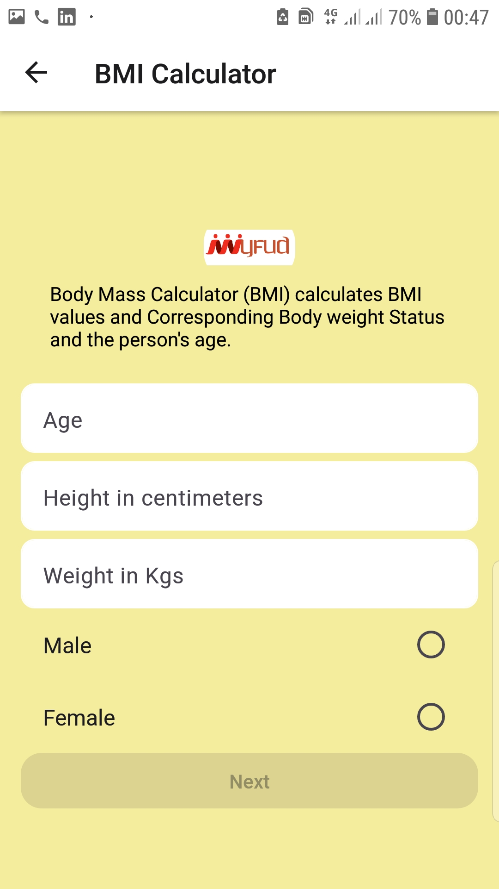

# MY FUD

## Features

### 1. Simplicity
myFud app is an app which is easy to navigate allowing users to access their information quickyly and easily. One of the key features about myFud app is that it has uncluttered screens and the button you click leads directly to the page you intended to access. This makes the app unambiguous and easy to use. 
### 2. Security
When it comes to user medical records, myFud app goes into a notch higher in ensuring that client information is safe from hackers, or accessed by third parties. The app security is watertight, ensuring user information is safe in their devices. 
### 3. Speed
myFud app has fast loading screens which is vital for impeccable user experience. Appropriate set of graphics are utilized in its build, and databases deployed are swift in response time. The app is simple, making it quick and easy to use. 
### 4. Flexibility
It is an app designed for mobile devices therefore, it is compatible with iOS and android devices. These are the commonly used operating systems that target users of the app normally use. Screen sizes are flexible and therefore, can be used in mobile devices running on iOS and android platforms. 
### 5. Color schemes
myFud app has colorful and bold schemes making it easy to the eye and appealing. Colors schemes make it stylish, therefore creating a professional aesthetic appeal to users. This improves the overall cosmetic appeal of the app to wide range of people who might use it. 

## Technologies used

### 1. React native 

[React Native](https://reactnative.dev/) is an open-source Javascript library for making user interfaces. Developers write on single codebase and the code can be built into android, iOS or web applications. This interacts seamlessly with native api's ensuring a good user experience.  

### 2. Firebase 

[Firebase](https://firebase.google.com/) is commonly known as a backend as a service. It provides four main services:
1. Authentication
2. Firestore Database
3. Storage 
4. Realtime Database

### 3. Nutrition Api

This project implements the [FoodData Central Api](https://fdc.nal.usda.gov/api-guide.html) from the U.S. Department of agriculture. The api acts as a source of information for the types of foods available for queries in the application as well as their nutritional values.

## System architecture

## Base dependencies

- [@expo/webpack-config](https://www.npmjs.com/package/@expo/webpack-config) an optimised webpack configuration for react native projects
- [@hookform/resolvers](https://www.npmjs.com/package/@hookform/resolvers) for form validation
- [@react-navigation/bottom-tabs](https://www.npmjs.com/package/@react-navigation/bottom-tabs) for navigation
- [@react-navigation/elements](https://www.npmjs.com/package/@react-navigation/elements) for navigation
- [@react-navigation/native](https://www.npmjs.com/package/@react-navigation/native) for navigation
- [@react-navigation/stack](https://www.npmjs.com/package/@react-navigation/stack) for navigation
- [date-fns](https://www.npmjs.com/package/date-fns) provides date functions
- [deepmerge](https://www.npmjs.com/package/deepmerge) used to merge objects
- [dotenv](https://www.npmjs.com/package/dotenv) loads environment variables 
- [expo](https://www.npmjs.com/package/expo) provides expo modules
- [expo-status-bar](https://www.npmjs.com/package/expo-status-bar) status bar api for expo environments
- [expo-system-ui](https://www.npmjs.com/package/expo-system-ui) provides additional support for user interfaces
- [firebase](https://www.npmjs.com/package/firebase) provides tools for firebase integration
- [react](https://www.npmjs.com/package/react) for creating user interfaces
- [react-dom](https://www.npmjs.com/package/react-dom) provides entry point for DOM and server renderes for react
- [react-hook-form](https://www.npmjs.com/package/react-hook-form) for form validation 
- [react-native](https://www.npmjs.com/package/react-native) provides react for native platforms
- [react-native-gesture-handler](https://www.npmjs.com/package/react-native-gesture-handler) provides a gesture management Api
- [react-native-pager-view](https://www.npmjs.com/package/react-native-pager-view) creates swipable pages
- [react-native-paper](https://www.npmjs.com/package/react-native-paper) provides material design components
- [react-native-reanimated](https://www.npmjs.com/package/react-native-reanimated) provides an animation Api
- [react-native-safe-area-context](https://www.npmjs.com/package/react-native-safe-area-context) allows for manipulation of inset values
- [react-native-screens](https://www.npmjs.com/package/react-native-screens) provides native navigation primmitives
- [react-native-svg](https://www.npmjs.com/package/react-native-svg) provides svg support
- [react-native-uuid](https://www.npmjs.com/package/react-native-uuid) provides a unique identifier
- [react-native-web](https://www.npmjs.com/package/react-native-web) enables react native to run on the web
- [yup](https://www.npmjs.com/package/yup) form validation
- [expo-image-picker](https://www.npmjs.com/package/expo-image-picker) allows for user to select media from system UI

## How to run in development environment

1. In the root directory create a `.env` file

```
    touch .env
```

2. Add the following to the .env file. Replace the placeholder text with actual values

```
FIREBASE_API_KEY=app key
FIREBASE_AUTH_DOMAIN=auth domain
FIREBASE_PROJECT_ID=project id
FIREBASE_STORAGE_BUCKET=storage bucket
FIREBASE_MESSAGING_SENDER_ID=your sender id
FIREBASE_APP_ID=your app id
FIREBASE_MEASUREMENT_ID=your measurement id
FDC_API_KEY=your api key

```
3. In the root directory run

```
npm install
```

1. Run the following command to start

```
npm start
```

# Usage

## Splash Screen
Click on Get Started to set up an account or Login to Sign In with an existing account 


## Login Screen
1. Click on Get Started to Sign In with an existing account 
2. Note that a valid email with no whitespaces is required as well as a password between 8 and 32 characters.


## Registration Process
A multistep process is used to collect necessary data for the client.

### Choose your Diabetes Type

### Choose your type of medication


### BMI calculator

### Create Account
Note that a valid email with no white spaces is required, a password between 8 and 32 characters is required. A name with atleast two characters is required and confirm password needs to match the password field.


## Dashboard
This is the first page you see after logging in.


`Click on the user icon` on the app bar to check on your user profile.


`Click on the floating plus button` to add a food item and select your meal type.


1. Search for one or more food items
2. `Click on the plus icon` on the results page to add food
3. `Click on the name` of food to get nutrition info.
4. `Click on Done` to submit food list


Press back button to go back to dashboard

1. `Swipe under today diet` plan to check for new entries
2. `Click on circle` to select image


3. The calories and carbs section accumulates based on daily consumption
4.  Click on `Blood Sugar` or `Insulin/Food` to change entries 


3.  On the bottom bar `click on logs` to see calendar of previous entries


